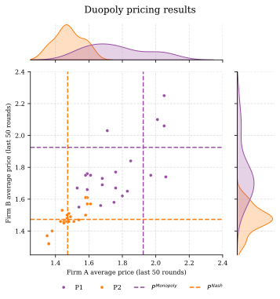
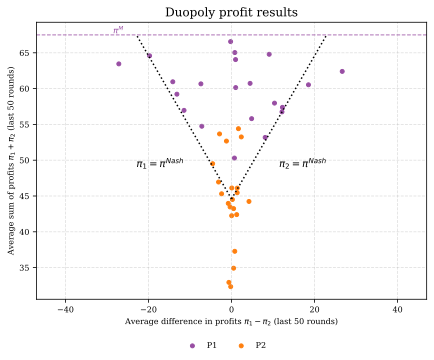
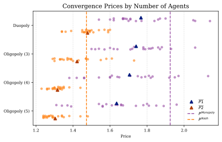
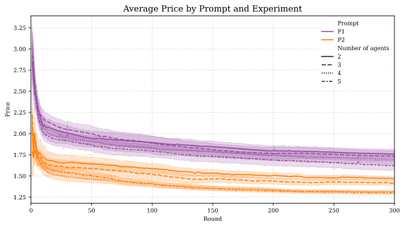

# Algorithmic Collusion and the Limits of Coordination

[](https://opensource.org/licenses/MIT)
[](https://www.python.org/downloads/)
[](https://github.com/astral-sh/uv)

## Master's Thesis: Testing Folk Theorem Predictions in AI-Mediated Markets

**Authors**: Julian Romero, Lucia Sauer, Moritz Peist  
**Institution**: Barcelona School of Economics  
**Programme**: Data Science for Decision Making  
**Academic Year**: 2024-2025  
**Supervisor**: Christopher Rauh

---

## Table of Contents

- [Overview](#overview)
- [Quick Start](#quick-start)
- [Repository Structure](#repository-structure)
- [Key Findings](#key-findings)
- [Experimental Results](#experimental-results)
- [Methodology](#methodology)
- [Technical Implementation](#technical-implementation)

---

## Overview

This repository contains the research infrastructure for investigating whether algorithmic collusion among Large Language Model (LLM) agents breaks down according to Folk Theorem predictions as market concentration decreases.

**Research Question**: Do LLM agent collusion mechanisms break down according to Folk Theorem predictions as the number of market participants increases from 2 to 5 agents?

**Key Innovation**: This study provides the first systematic test of theoretical collusion boundaries in AI-mediated markets, extending the work of Fish et al. (2025) from duopoly to oligopoly settings. Unlike traditional RL algorithms requiring extensive training, LLMs arrive pre-trained on vast corpora about markets and strategic behavior, enabling sophisticated coordination strategies.

## Quick Start

### Installation

```bash
# Clone repository
git clone https://github.com/luciasauer/algorithmic-collusion-thesis.git
cd algorithmic-collusion-thesis

# Install dependencies with uv
uv sync
```

### Environment Setup

Create a `.env` file in the project root:

```bash
MISTRAL_API_KEY=your_mistral_api_key_here
MODEL_NAME=mistral-large-2411
```

### Running Experiments

```bash
# Run individual experiments
python experiments_synthetic/duopoly.py
python experiments_synthetic/oligopoly_3.py
python experiments_synthetic/oligopoly_4.py
python experiments_synthetic/oligopoly_5.py

# Baseline monopoly experiment
python experiments_synthetic/monopoly.py
```

### Data Analysis

```bash
# Start Jupyter for analysis
jupyter lab

# Key notebooks:
# - notebooks/regression.ipynb - Core statistical analysis
# - notebooks/plots.ipynb - Data visualization
# - notebooks/text_analysis_clusters.ipynb - Agent reasoning analysis
```

### Code Quality

```bash
# Lint and format code
ruff check
ruff format

# Run pre-commit hooks
pre-commit run --all-files
```

## Repository Structure

```
algorithmic-collusion-thesis/
├── src/
│   ├── agents/              # LLM agent implementations
│   ├── environment/         # Market simulation (Calvano demand)
│   ├── experiment/          # Experiment orchestration
│   ├── prompts/             # Prompt engineering and management
│   ├── analysis/            # Statistical analysis tools
│   ├── plotting/            # Visualization utilities
│   └── utils/               # Utility functions and logging
├── experiments_synthetic/   # Experiment execution scripts
├── notebooks/              # Jupyter analysis notebooks
├── data/                   # Experimental data storage
├── latex/                  # Thesis manuscript and figures
└── pyproject.toml         # Dependencies (uv-managed)
```

## Technical Architecture

**Core Components:**

- **LLM Agents**: Mistral API integration with 100-period rolling memory
- **Market Environment**: Calvano et al. (2020) demand specification with logit market shares
- **Experiment Framework**: 300-period repeated pricing games with rate limiting
- **Analysis Pipeline**: Statistical models and text analysis of agent reasoning

**Key Dependencies:**

- `polars` - High-performance DataFrame operations
- `mistralai` - LLM API integration
- `statsmodels/linearmodels` - Econometric analysis
- `seaborn/matplotlib` - Statistical visualization
- `sentence-transformers` - Text analysis and embeddings

## Troubleshooting

**Common Issues:**

- **API Rate Limits**: Built-in rate limiting prevents overuse; adjust `rate_limit_seconds` if needed
- **Memory Usage**: Large experiments may require substantial RAM for data processing
- **Model Availability**: Ensure Mistral API key has access to `mistral-large-2411`

**Development Tips:**

- Use `notebooks/` for exploratory analysis
- Results are automatically saved in Parquet format in `data/results/`
- All experiment parameters are logged for reproducibility

---

## Key Findings

### Core Statistical Results

| Metric | Finding | Significance |
|--------|---------|-------------|
| **Group Size Effect** | **-3.7%** price reduction per additional competitor | ***p < 0.001*** |
| **Cumulative Impact** | **-10.6%** total price reduction (duopoly → 5-agent) | Highly significant |
| **Prompt Sensitivity** | **-18.8%** price difference between specifications | ***p < 0.001*** |
| **Model Explanatory Power** | **R² > 0.66** | Strong fit |

### Theoretical Validation

- **Strong empirical support** for Folk Theorem predictions
- **Smooth breakdown pattern** - coordination erosion follows predictable patterns
- **Robust across specifications** - effects consistent across alternative models
- **Independent prompt effects** - market structure remains fundamental determinant

### Economic Magnitude

Moving from duopoly (n=2) to five-agent competition (n=5):

- **Price reduction**: (e^(-0.0373 × 3) - 1) × 100% = -10.6%
- **Demonstrates**: Algorithmic collusion faces substantial constraints as market participants increase
- **Implication**: Quantitative evidence for theoretical predictions about coordination difficulty in larger groups

The **Folk Theorem** establishes that collusion requires δ ≥ (π^D - π^C)/π^D where π^C = π^M/n. As n increases, the required discount factor approaches 1, theoretically making collusion unsustainable.

---

## Experimental Results

### Monopoly Model Validation

| Model | Mean Price | Std. Dev. | Near 99% Profit | Outside Conv. Range |
|-------|------------|-----------|-----------------|-------------------|
| `mistral-large-2411` | **1.8028** | 0.0233 | **100%** | 0 |
| `magistral-small-2506` | 1.8083 | 0.1573 | 98% | 4 |

**Note**: Mistral-Large-2411 demonstrates superior convergence to monopoly pricing with zero periods outside convergence range.

### Duopoly Experiment Results

<div align="center">
  
  
</div>

**Key Observations:**

- Sustained supracompetitive pricing above Nash equilibrium
- Prompt-dependent coordination levels with systematic differences
- Reward-punishment mechanisms evidenced in price dynamics

### Oligopoly Breakdown Patterns

<div align="center">
  
</div>

**Folk Theorem Validation:**

- Systematic price erosion as group size increases
- Maintained coordination even in 5-agent settings
- Predictable degradation following theoretical predictions

### Run-Level Regression Results

```
Dependent Variable: ln(Price)
                    (1) Baseline    (2) With Controls
Group Size         -0.0373***      -0.0373***
                   (0.0055)        (0.0054)

P2 Prompt          -0.2082***      -0.2082***
                   (0.0125)        (0.0125)

α = 3.2                            0.0303**
                                   (0.0140)

α = 10.0                           0.0166
                                   (0.0157)

Constant           0.6573***       0.6417***
                   (0.0203)        (0.0218)

Observations       168             168
R-squared          0.666           0.675

Notes: *** p<0.01, ** p<0.05, * p<0.1
Robust standard errors (HC3) in parentheses.
```

<div align="center">
  
</div>

---

## Methodology

### Experimental Framework

**Synthetic Market Environment** → **LLM Agent Competition** → **Strategic Outcome Analysis**


**Experimental Design:**

- **Base Framework**: Extension of Fish et al. (2025) synthetic market simulation
- **Market Structures**: 2, 3, 4, 5 competing LLM agents
- **Game Duration**: 300-period repeated pricing games
- **Demand Function**: Calvano et al. (2020) specification for clean counterfactuals
- **Strategic Setting**: Bertrand competition with differentiated products

**LLM Implementation:**

- **Primary Model**: `mistral-large-2411` (superior convergence)
- **Alternative**: `magistral-small-2506` (robustness testing)
- **Prompt Engineering**: Two systematic specifications (P1, P2) testing coordination propensity
- **Memory Architecture**: 100-period rolling history for strategic learning

**Market Environment:**
Following Calvano et al. (2020): q_i = (a_i - p_i + μ∑p_j) / (1 + μ(n-1))

Where a_i is demand intercept for firm i, μ is substitutability parameter, and n is number of competitors.

### Analysis Methodology

**Run-Level Equilibrium Analysis:**
Focus on final 50 periods (251-300) for convergence:
ln(Price_run) = β₀ + β₁·GroupSize + β₂·PromptType + X'γ + ε

**Textual Reasoning Analysis:**

- Clustering: HDBSCAN algorithm on sentence embeddings
- Validation: Human interpretation verification
- Strategic Patterns: Identification of reward-punishment language

**Robustness Testing:**

- Alternative aggregation windows (25, 75, 100 periods)
- Non-linear specifications with interaction terms
- Bootstrap confidence intervals
- Outlier sensitivity analysis

## Technical Implementation

**Development Workflow:**

1. Configure API keys in `.env` file
2. Run experiments using scripts in `experiments_synthetic/`
3. Analyze results using Jupyter notebooks in `notebooks/`
4. Generate visualizations and statistical outputs

**Key Technical Features:**

- Automated experiment execution with rate limiting
- Real-time statistical analysis with multiple model specifications
- Advanced text clustering for agent reasoning analysis
- Publication-ready visualizations with economic benchmark overlays
- Comprehensive robustness testing across specifications

---

## License

This project is licensed under the MIT License. This research is conducted for academic purposes under standard fair use principles.
