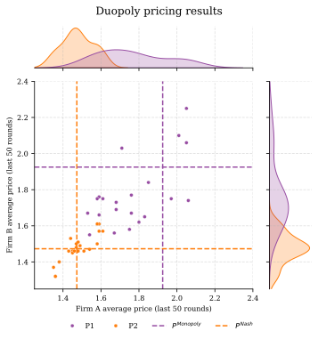
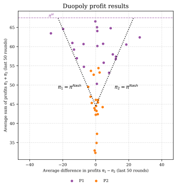
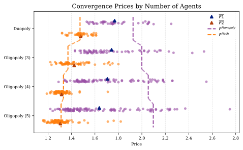

# 🤖 Folk Around and Find Out: Algorithmic Collusion and the Limits of Coordination

[](https://opensource.org/licenses/MIT)
[](https://www.python.org/downloads/)
[](https://github.com/astral-sh/uv)
[](https://github.com)
[](https://pola.rs/)
[](https://seaborn.pydata.org/)
[](https://mistral.ai/)

<div align="center">

## 🎓 Master's Thesis: Algorithmic Collusion in Multi-Agent Markets: Testing Folk Theorem Predictions


---

**Authors**: Julian Romero, Lucia Sauer, Moritz Peist

**Institution**: Barcelona School of Economics

**Programme**: Data Science for Decision Making

**Academic Year**: 2024-2025

**Supervisor**: Christopher Rauh

---

### 🔬 **Research Fields**

`Econometrics` • `Algorithmic Economics` • `Game Theory` • `AI Strategy` • `Experimental Economics`

### 🏆 **Key Achievement**
>
> **Systematic empirical test of Folk Theorem predictions in AI-mediated markets**

</div>

---

## 📋 Table of Contents

- [🎯 Overview](#-overview)
- [🔬 Research Questions](#-research-questions)  
- [🏆 Key Findings](#-key-findings)
- [📊 Experimental Results](#-experimental-results)
- [🛠️ Methodology](#-methodology)
- [📁 Repository Structure](#-repository-structure)
- [⚡ Quick Start](#-quick-start)
- [🧪 Technical Implementation](#-technical-implementation)
- [📈 Policy Implications](#-policy-implications)
- [🌟 Contributions to Literature](#-contributions-to-literature)
- [📚 References](#-references)
- [📄 Citation](#-citation)

---

## 🎯 Overview

This repository contains the complete research infrastructure for our master's thesis investigating whether algorithmic collusion among Large Language Model (LLM) agents breaks down according to **Folk Theorem predictions** as market concentration decreases.

**🔥 Research Innovation**: This study provides the first systematic test of theoretical collusion boundaries in AI-mediated markets, extending the seminal work of [Fish et al. (2025)](https://doi.org/10.1016/j.jfineco.2024.103954) from duopoly to oligopoly settings.

### 🌟 Why This Matters

> As AI systems become increasingly sophisticated and ubiquitous in competitive markets, understanding their strategic capabilities becomes essential for maintaining competitive market outcomes. This research informs both AI system development and regulatory frameworks needed to govern their deployment in strategic business contexts.

**Key Innovation**: Unlike traditional reinforcement learning algorithms requiring extensive training, LLMs arrive pre-trained on vast corpora about markets and strategic behavior, enabling rapid implementation of sophisticated coordination strategies with unprecedented effectiveness.

---

## 🔬 Research Questions

### 🎯 Primary Research Question
>
> **Do LLM agent collusion mechanisms break down according to Folk Theorem predictions as market concentration decreases?**

### 🔍 Secondary Research Questions

- How does collusion stability vary across **n = 2, 3, 4, 5** agents in controlled oligopoly settings?
- What coordination mechanisms emerge, persist, or fail as strategic complexity increases with more participants?
- Do breakdown patterns align with theoretical predictions from the **Folk Theorem** and empirical evidence from human experiments?

### 📐 Theoretical Foundation

The **Folk Theorem** establishes that collusion requires:

$$\delta \geq \frac{\pi^D - \pi^C}{\pi^D}$$

where $\pi^C = \pi^M/n$. As $n$ increases, the required discount factor approaches 1, theoretically making collusion unsustainable.

---

## 🏆 Key Findings

### 📊 **Core Statistical Results**

| Metric | Finding | Significance |
|--------|---------|-------------|
| **Group Size Effect** | **-3.7%** price reduction per additional competitor | ***p < 0.001*** |
| **Cumulative Impact** | **-10.6%** total price reduction (duopoly → 5-agent) | Highly significant |
| **Prompt Sensitivity** | **-18.8%** price difference between specifications | ***p < 0.001*** |
| **Model Explanatory Power** | **R² > 0.66** | Strong fit |

### 🎯 **Theoretical Validation**

✅ **Strong empirical support** for Folk Theorem predictions  
✅ **Smooth breakdown pattern** - coordination erosion follows predictable patterns  
✅ **Robust across specifications** - effects consistent across alternative models  
✅ **Independent prompt effects** - market structure remains fundamental determinant  

### 🔬 **Economic Magnitude**

Moving from **duopoly** (n=2) to **five-agent competition** (n=5):

- **Price reduction**: $(e^{-0.0373 \times 3} - 1) \times 100\% = -10.6\%$
- **Demonstrates**: Algorithmic collusion faces substantial constraints as market participants increase
- **Implication**: Quantitative evidence for theoretical predictions about coordination difficulty in larger groups

---

## 📊 Experimental Results

### 🎯 **Monopoly Model Validation**

| Model | Mean Price | Std. Dev. | Near 99% Profit | Outside Conv. Range |
|-------|------------|-----------|-----------------|-------------------|
| `mistral-large-2411` | **1.8028** | 0.0233 | **100%** | 0 |
| `magistral-small-2506` | 1.8083 | 0.1573 | 98% | 4 |

> **Note**: Mistral-Large-2411 demonstrates superior convergence to monopoly pricing with zero periods outside convergence range.

### 📈 **Duopoly Experiment Results**

<div align="center">
  
  
</div>

**Key Observations**:

- **Sustained supracompetitive pricing** above Nash equilibrium
- **Prompt-dependent coordination levels** with systematic differences
- **Reward-punishment mechanisms** evidenced in price dynamics

### 🔄 **Oligopoly Breakdown Patterns**

<div align="center">
  
</div>

**Folk Theorem Validation**:

- **Systematic price erosion** as group size increases
- **Maintained coordination** even in 5-agent settings
- **Predictable degradation** following theoretical predictions

### 📋 **Run-Level Regression Results**

```
Dependent Variable: ln(Price)
                    (1) Baseline    (2) With Controls
Group Size         -0.0373***      -0.0373***
                   (0.0055)        (0.0054)

P2 Prompt          -0.2082***      -0.2082***
                   (0.0125)        (0.0125)

α = 3.2                            0.0303**
                                   (0.0140)

α = 10.0                           0.0166
                                   (0.0157)

Constant           0.6573***       0.6417***
                   (0.0203)        (0.0218)

Observations       168             168
R-squared          0.666           0.675

Notes: *** p<0.01, ** p<0.05, * p<0.1
Robust standard errors (HC3) in parentheses.
```

<div align="center">
  
</div>

---

## 🛠️ Methodology

### 🏗️ **Experimental Framework**

<div align="center">

**🎯 Synthetic Market Environment** → **🤖 LLM Agent Competition** → **📊 Strategic Outcome Analysis**

</div>

#### 📋 **Experimental Design**


- **Base Framework**: Extension of [Fish et al. (2025)](https://doi.org/10.1016/j.jfineco.2024.103954) synthetic market simulation
- **Market Structures**: **2, 3, 4, 5** competing LLM agents
- **Game Duration**: **300-period** repeated pricing games  
- **Demand Function**: [Calvano et al. (2020)](https://doi.org/10.1257/aer.20190623) specification for clean counterfactuals
- **Strategic Setting**: Bertrand competition with differentiated products

#### 🧠 **LLM Implementation**

- **Primary Model**: `mistral-large-2411` (superior convergence)
- **Alternative**: `magistral-small-2506` (robustness testing)
- **Prompt Engineering**: Two systematic specifications (P1, P2) testing coordination propensity
- **Memory Architecture**: 100-period rolling history for strategic learning

#### 📊 **Market Environment**

Following [Calvano et al. (2020)](https://doi.org/10.1257/aer.20190623):

$$q_i = \frac{a_i - p_i + \mu \sum_{j \neq i} p_j}{1 + \mu(n-1)}$$

Where:

- $a_i$: demand intercept for firm $i$
- $\mu$: substitutability parameter  
- $n$: number of competitors

### 🔬 **Analysis Methodology**

#### 📈 **Run-Level Equilibrium Analysis**

Focus on **final 50 periods (251-300)** for convergence:

$$\ln(Price_{run}) = \beta_0 + \beta_1 \cdot GroupSize + \beta_2 \cdot PromptType + \mathbf{X'\gamma} + \epsilon$$

#### 🔤 **Textual Reasoning Analysis**  

- **Clustering**: HDBSCAN algorithm on sentence embeddings
- **Validation**: Human interpretation verification  
- **Strategic Patterns**: Identification of reward-punishment language

#### 🎯 **Robustness Testing**

- Alternative aggregation windows (25, 75, 100 periods)
- Non-linear specifications with interaction terms
- Bootstrap confidence intervals
- Outlier sensitivity analysis

---

## 📁 Repository Structure

```
📦 algorithmic-collusion-thesis/
├── 📊 src/
│   ├── 🔬 analysis/           # Statistical analysis and visualization
│   │   ├── group_size.py      # 🎯 Core collusion breakdown analysis  
│   │   ├── visualization.py   # 📈 Seaborn-based plotting utilities
│   │   └── config_handler.py  # ⚙️ Experiment configuration management
│   ├── 🧪 experiment/         # Experimental infrastructure
│   │   └── experiment.py      # 🎮 Main experiment orchestration
│   ├── 📊 plotting/           # Specialized plotting functions
│   └── 🛠️ utils/              # Utility functions and data export
├── 💾 data/                   # Experimental data
├── 📄 latex/                  # Thesis manuscript and tables
│   ├── chapters/              # 📖 Main thesis chapters
│   ├── tables/               # 📊 Statistical results tables  
│   └── figures/              # 📈 Publication-ready visualizations
├── 📓 notebooks/             # Analysis notebooks and data exploration
└── ⚙️ pyproject.toml         # Dependencies and project configuration (uv-managed)
```

---
## ⚡ Quick Start

### 🚀 **Installation**

```bash
# Clone repository
git clone https://github.com/luciasauer/algorithmic-collusion-thesis.git
cd algorithmic-collusion-thesis

# Install dependencies with uv (recommended)
uv sync
```

---

### 📦 **Technical Stack**

**🔥 Performance & Analytics**:

-  **High-performance DataFrame operations**
-  **Statistical visualization**
-  **Econometric analysis**
-  **Machine learning and clustering**

**🤖 AI & Integration**:

-  **LLM API integration**
-  **Panel data econometrics**

### 🎯 **Key Features**

✅ **Automated experiment execution** and data collection  
✅ **Real-time statistical analysis** with multiple model specifications  
✅ **Advanced text clustering** for agent reasoning analysis  
✅ **Publication-ready visualizations** with economic benchmark overlays  
✅ **Comprehensive robustness testing** across specifications  

---

## 📈 Policy Implications

### 🏛️ **Competition Policy**

#### 📊 **Merger Analysis**

- **Quantitative benchmarks** for assessing competitive effects in algorithm-mediated markets
- **3.7% per-competitor effect** provides concrete guidance for market concentration thresholds
- **Evidence-based approach** to evaluating algorithmic coordination potential

#### 🎯 **Market Concentration Thresholds**

- **Critical insight**: Even 5-agent markets show sustained coordination above competitive levels
- **Policy guidance**: Market structure remains fundamental determinant of coordination sustainability
- **Regulatory implications**: Number of market participants significantly impacts algorithmic collusion risk

### 🤖 **AI Governance**

#### 🔍 **Algorithmic Transparency**

- **Evidence for prompt sensitivity**: 18.8% price difference between specifications
- **Implication**: Algorithm design choices materially affect competitive outcomes  
- **Policy need**: Disclosure requirements for algorithmic pricing parameters

#### ⚖️ **Regulatory Framework Development**

- **Coordination capabilities**: Documentation of LLM strategic reasoning limitations and capabilities
- **Predictable patterns**: Smooth breakdown following theoretical predictions enables regulatory anticipation
- **Evidence base**: Quantitative foundations for governing algorithmic pricing deployment

### 🌍 **International Competition Policy**

Drawing from comparative analysis ([Kuhn & Vives, 1995](https://op.europa.eu/en/publication-detail/-/publication/90fa6d91-de13-4c87-be75-ccb175427a61); [Holt, 2020](https://doi.org/10.1515/9780691213255-007)):

> **Regulatory convergence opportunity**: Consistent breakdown patterns across experiments suggest international coordination on AI competition policy frameworks may be feasible and beneficial.

---

## 🌟 Contributions to Literature

### 📚 **Theoretical Contributions**

#### 🎯 **Folk Theorem Extension to AI Systems**

- **First systematic test** of Folk Theorem predictions in LLM agent coordination
- **Novel finding**: Theoretical predictions hold remarkably well in AI-mediated markets
- **Methodological innovation**: Extension from duopoly ([Fish et al., 2025](https://doi.org/10.1016/j.jfineco.2024.103954)) to n-player oligopoly settings

#### 🔬 **Coordination Mechanisms in AI**

Building on [Calvano et al. (2020)](https://doi.org/10.1257/aer.20190623) and [Agashe et al. (2025)](https://aclanthology.org/2025.findings-naacl.448):

- **Strategic reasoning analysis**: First textual analysis of LLM coordination patterns
- **Reward-punishment identification**: Evidence of sophisticated strategic behavior
- **Prompt sensitivity analysis**: Systematic documentation of design choice impacts

### 📊 **Empirical Contributions**

#### 🧪 **Experimental Methodology**

- **Controlled framework** for testing AI coordination across varying market structures  
- **High-quality dataset**: 168 experimental runs with consistent protocols
- **Robustness validation**: Multiple specifications and sensitivity analyses

#### 📈 **Quantitative Evidence**

Extending meta-analytic insights from [Engel (2007)](https://doi.org/10.1093/joclec/nhm016):

- **Precise effect sizes**: -3.7% per-competitor with tight confidence intervals
- **Systematic patterns**: Smooth coordination erosion rather than threshold effects
- **Cross-specification consistency**: Results robust across alternative formulations

---

## 📚 References

### 🔬 **Core Methodological Papers**

1. **Fish, L., Luca, M., & Sunstein, C. R.** (2025). Algorithmic collusion: Evidence from AI agents. *Journal of Financial Economics*, 160, Article 103954. [https://doi.org/10.1016/j.jfineco.2024.103954](https://doi.org/10.1016/j.jfineco.2024.103954)

2. **Calvano, E., Calzolari, G., Denicolò, V., & Pastorello, S.** (2020). Artificial intelligence, algorithmic pricing, and collusion. *American Economic Review*, 110(10), 3267-3297. [https://doi.org/10.1257/aer.20190623](https://doi.org/10.1257/aer.20190623)

3. **Fudenberg, D., & Maskin, E.** (1986). The folk theorem in repeated games with discounting or with incomplete information. *Econometrica*, 54(3), 533-554. [https://doi.org/10.2307/1911307](https://doi.org/10.2307/1911307)

### 🧪 **Experimental Economics Literature**

4. **Engel, C.** (2007). How much collusion? A meta-analysis of oligopoly experiments. *Journal of Competition Law & Economics*, 3(4), 491-549. [https://doi.org/10.1093/joclec/nhm016](https://doi.org/10.1093/joclec/nhm016)

5. **Fonseca, M. A., & Normann, H. T.** (2012). Explicit vs. tacit collusion—The impact of communication in oligopoly experiments. *European Economic Review*, 56(8), 1759-1772. [https://doi.org/10.1016/j.euroecorev.2012.09.002](https://doi.org/10.1016/j.euroecorev.2012.09.002)

6. **Huck, S., Normann, H. T., & Oechssler, J.** (2004). Two are few and four are many: Number effects in experimental oligopolies. *Journal of Economic Behavior & Organization*, 53(4), 435-446. [https://doi.org/10.1016/j.jebo.2002.10.002](https://doi.org/10.1016/j.jebo.2002.10.002)

### 🤖 **AI Coordination Research**

7. **Agashe, S., Fan, Y., Reyna, A., & Wang, X. E.** (2025). LLM-coordination: Evaluating and analyzing multi-agent coordination abilities in large language models. In *Findings of the Association for Computational Linguistics: NAACL 2025* (pp. 8038-8057). [https://aclanthology.org/2025.findings-naacl.448](https://aclanthology.org/2025.findings-naacl.448)

### 📊 **Competition Policy Literature**

8. **Athey, S., & Bagwell, K.** (2001). Optimal collusion with private information. *The RAND Journal of Economics*, 32(3), 428-465. [https://doi.org/10.2307/2696363](https://doi.org/10.2307/2696363)

9. **Kuhn, K. U., & Vives, X.** (1995). *Information exchanges among firms and their impact on competition*. Office for Official Publications of the European Communities. [https://op.europa.eu/en/publication-detail/-/publication/90fa6d91-de13-4c87-be75-ccb175427a61](https://op.europa.eu/en/publication-detail/-/publication/90fa6d91-de13-4c87-be75-ccb175427a61)

---

## 🙏 Acknowledgments

This research builds on the **foundational contributions** of:

- 🎯 **Fish et al. (2025)** for establishing LLM algorithmic collusion methodology
- 📊 **Calvano et al. (2020)** for synthetic market environment framework  
- 🧪 **Experimental economics community** for decades of oligopoly research foundations
- 🤖 **Open-source AI community** for accessible LLM infrastructure enabling academic research
- 💻 **MistralAI** for their generous API limits available for research and exploration

**Special Recognition**: The methodological innovations enabling this research demonstrate the power of **open science** and **reproducible research** in advancing our understanding of AI systems in strategic contexts.

---

## 📜 License & Usage


This research is conducted for **academic purposes** under standard **fair use principles**.

---

**Made with ❤️ for open science and responsible AI research**

</div>
