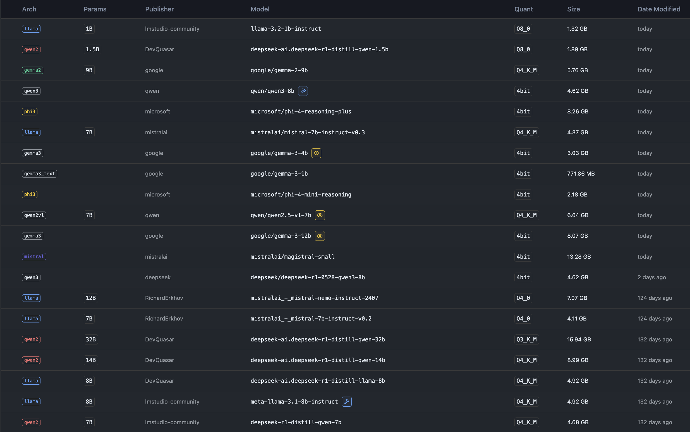

# Model Performance Testing – Feasibility Analysis

This section evaluates the capabilities of various open-source language models to function as pricing agents in simulated economic environments.

## Models Tested

The models assessed are shown in the image below. These were selected based on their feasibility to run on an Apple M3 Pro machine with 36GB of RAM.

## Environment and Experimental Setup

To evaluate model performance, we adopt criteria inspired by *Algorithmic Collusion by LLMs*, with the following benchmarks:

* **Valid Output**: The model produces a syntactically correct and interpretable price as instructed in the prompt.
* **Convergence to a Price $p$**: In periods 201–300, prices are considered converged if the 90th and 10th percentiles are within 5% of a common value $p$.
* **Monopoly Price $p^M$**: The price $p_1$ that maximizes the profit $\pi_1 = (p_1 − \alpha c_1) \cdot q_1$.

The demand function is based closely on Calvano et al. (2020b):

$$
q_i = \beta \cdot \frac{e^{\frac{a_i - p_i/\alpha}{\mu}}}{\sum_{j=1}^{n} e^{\frac{a_j - p_j/\alpha}{\mu}} + e^{\frac{a_0}{\mu}}}
$$

Prompts are designed following Fish et al. (2024). In each period, each agent receives a structured prompt containing:

1. **Prompt Prefix**: A brief description of the agent's strategic goals.
2. **Market Information**: Includes marginal costs and other relevant text-based parameters.
3. **Market History**: Price, quantity, and profit history from the previous 100 periods.
4. **Plans and Insights**: Since LLMs have no persistent memory, we simulate continuity by asking each agent to document its internal reasoning and strategic plans at every period, which are then reused in the next prompt.
5. **Output Instructions**: The model must explain its reasoning and output a single price decision.

> ⚠️ **Note**: Due to their stochastic nature, LLMs can vary significantly in behavior — both across different agents and across repeated runs in the same environment.

## Useful Links

* [LM Studio Python SDK Documentation](https://lmstudio.ai/docs/python)
* [LM Studio SDK Blog – Output Formatting](https://lmstudio.ai/blog/introducing-lmstudio-sdk#enforce-output-format-with-pydantic-zod-or-json-schema)
* [Pricing Simulation Logic – GitHub](https://github.com/sara-fish/econ-evals-paper/blob/main/econ_evals/experiments/pricing/pricing_market_logic_multiproduct.py)
* [Mistral Structured Output Documentation](https://docs.mistral.ai/capabilities/structured-output/custom_structured_output/)