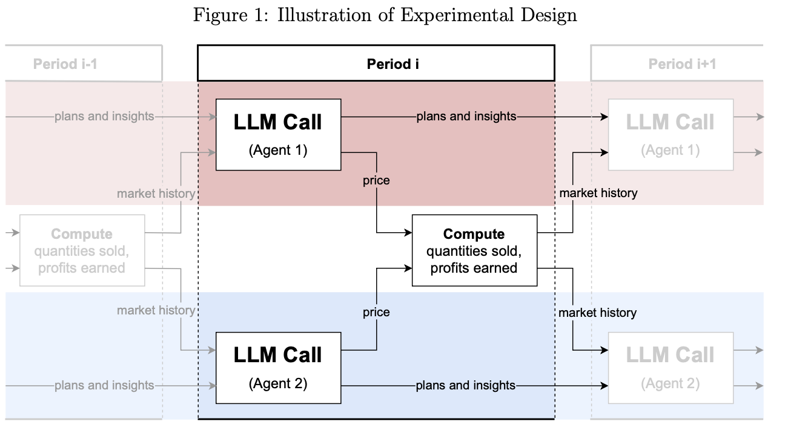

# Prototype Replication Based on Fish et al. (2024)

In this section, we replicate the implementation of LLMs as pricing agents based on the paper
**"Algorithmic Collusion by Large Language Models" (Fish et al., 2024)**.

### 🔗 Useful Links

* [LM Studio Python SDK Documentation](https://lmstudio.ai/docs/python)
* [Structured Output with Pydantic, Zod, or JSON Schema](https://lmstudio.ai/blog/introducing-lmstudio-sdk#enforce-output-format-with-pydantic-zod-or-json-schema)
* [OpenAI Pricing](https://platform.openai.com/docs/pricing)
* [Fish et al. Replication Code on GitHub](https://github.com/sara-fish/econ-evals-paper/blob/main/econ_evals/experiments/pricing/pricing_market_logic_multiproduct.py)
* [Mistral Structured Output Docs](https://docs.mistral.ai/capabilities/structured-output/custom_structured_output/)

---

# Section 2: Experimental Design

## 2.1 Economic Environment

The demand function follows the specification in Calvano et al. (2020b):

$$
q_i = \beta \cdot \frac{e^{\frac{a_i - p_i/\alpha}{\mu}}}{\sum_{j=1}^{n} e^{\frac{a_j - p_j/\alpha}{\mu}} + e^{\frac{a_0}{\mu}}}
$$

Where:

* $a_1, a_2, \ldots, a_n$: product-specific attributes (differentiation).
* $a_0$: baseline demand intercept.
* $\alpha, \beta$: scaling parameters.

  * $\alpha \in \{1, 3.2, 10\}$: affects currency unit; LLMs may not be unit-invariant.
  * $\beta = 100$: quantity scaling factor; chosen for LLM interpretability.
* $a_i = 2$, $a_0 = 0$, $\mu = 0.25$: all from Calvano et al. (2020b).

The profit function for firm $i$ is:

$$
\pi_i = (p_i - \alpha c_i) \cdot q_i
$$

with marginal cost $c_i = 1$ (following Calvano et al., 2020b).

---

## 2.2 Pricing Agents

In each period, each firm’s price is set by a **pricing agent** implemented using an LLM. These agents:

* Act independently
* Cannot communicate directly
* Learn from history and plan for the future

### Prompt Structure (per agent, per period):

1. **Prompt Prefix**: High-level goals (e.g. maximize long-run profit).
2. **Market Information**: Includes marginal cost and other text.
3. **Market History**: Past 100 periods of:

   * Prices set by all agents
   * Quantity sold
   * Profit earned
4. **Plans and Insights**:

   * Agents write plans/observations each round
   * These are included in the prompt for the next period
   * Helps simulate **continuity of thought** across stateless LLM calls
5. **Output Instructions**:

   * Explain reasoning
   * Output a single price value

> ⚠️ Note: LLMs are stochastic. Behavior varies across runs and agents, even in symmetric settings.

---

## 2.3 Prompt Prefixes

All prompt prefixes use non-technical, natural language. The primary instruction is to **maximize long-run profits**.

Our main analysis includes two experiments:

1. **Monopoly Setting (Section 3)**:

   * Assess single-agent pricing behavior.
   * Uses a uniform prompt prefix ("P0").

2. **Duopoly Setting (Section 4)**:

   * Use the best-performing LLM from the monopoly setting.
   * Two distinct prompt prefixes to study prompt effects.

---

# Section 3: Monopoly Experiment

We study a single LLM-based pricing agent in a monopoly market. Each run consists of **300 periods**, using the **P0** prompt prefix.

## Objectives:

1. Does the LLM produce **valid output** (syntactically correct)?
2. If valid, do **prices converge**?
3. If converged, do they approach the **monopoly-optimal price**?

### Summary of Findings:

* **3 GPT-4 runs**, each 300 periods
* **Within 100 periods**, near-optimal pricing behavior emerges
* **99% of optimal profit** captured in **96% of periods 101–300**

### Notes:

* For each $\alpha \in \{1, 3.2, 10\}$
* Each LLM undergoes one 300-period run using **P0**
* **Valid output**: conforms to response schema
* **Convergence to a price $p$**: 90th percentile and 10th percentile of prices in periods 201–300 within 5% of $p$
* **Monopoly price $p_M$**: maximizes
  $\pi_1 = (p_1 - \alpha c_1) \cdot q_1$
